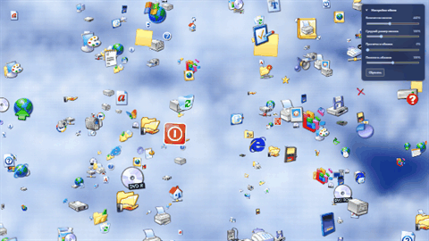

# Wallpaper Vibe WinXP

**English** | [Русский](README.ru.md)

Interactive HTML wallpaper inspired by Windows XP: deep blue skies, soft volumetric clouds, and familiar icons floating at different depths. Explore an endless cloudscape, customize its appearance, and make icons dissolve into pixels with a click.

## Features

- An infinite canvas with seamless generation of new areas.
- Four depth layers with varying icon sizes and parallax.
- Smooth dragging with inertia.
- Pixel disintegration when you click an icon.
- Adjustable icon count, average icon size, cloud gaps, and cloud density.
- Settings saved between sessions.
- Fully local operation with no internet connection required.

## Getting started

Open **index.html** in a modern browser. To use it as your desktop wallpaper, import the file into an application that supports HTML wallpapers, such as Lively Wallpaper or Wallpaper Engine.

Keep **index.html**, **icons.js**, and the **assets** folder together.

## Controls

| Action | Control |
| --- | --- |
| Explore the cloudscape | Hold the left mouse button and drag |
| Make an icon dissolve into pixels | Click an icon without dragging |
| Adjust settings | Use the panel in the top-right corner |
| Collapse the panel | Click its title, «Настройки обоев» (Wallpaper settings) |
| Restore default settings and icons | Click «Сбросить» (Reset) |

The wallpaper's settings panel currently uses Russian labels.

## Settings

| Setting | Range | Effect |
| --- | --- | --- |
| Icon count | 0–1000% | Adjusts icon density relative to the default count |
| Average icon size | 25–300% | Scales icons while preserving size differences between depth layers |
| Cloud gaps | 0–100% | Reveals more of the blue sky |
| Cloud density | 0–200% | Makes clouds appear lighter or thicker |

## License

The code is available under the [MIT License](LICENSE).

Third-party icons in **assets** remain subject to their respective owners' rights and licenses. The project's MIT License does not cover these images.
